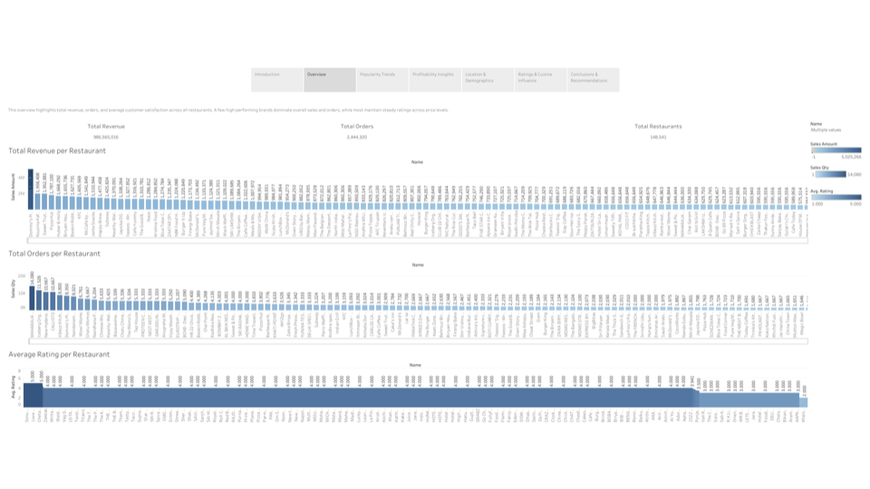

# Zomato Restaurant Performance Analysis

**[View the live interactive dashboard on Tableau Public →](https://public.tableau.com/views/S7FinalProject01_5/ZomatoRestaurantReport2025)**

## Business Question

Which restaurants drive the most revenue and orders, and what actually explains their success — rating, meal cost, cuisine, or city?

## Tools & Skills

- **Tableau** — data modeling (joining orders + restaurant tables on restaurant ID), calculated fields, dashboard design
- **Data cleaning** — date formatting, derived fields (month/year, total sales, total orders), category simplification
- **Data storytelling** — a 7-section dashboard flow from overview → popularity → profitability → location → ratings/cuisine → recommendations

## Key Insights

- A small group of restaurants — Domino's Pizza, Kouzina Kafe, Sweet Truth — account for the majority of total revenue and orders, all with ratings above 4.0.
- **Rating isn't the driver of revenue.** Most top earners cluster in a mid-range 3.8–4.0 rating band; popularity tracks more with brand reach and accessibility than food quality alone.
- North Indian, Chinese, and Indian cuisines dominate total revenue, led by familiar, fast-service brands (Domino's, KFC, Pizza Hut).
- Delhi, Bangalore, and Ahmedabad are the top-grossing cities, with several smaller markets showing untapped demand.
- Some restaurants (Janta Snacks, Happy Brew Cafe, Cafe Yummy) post the highest **average sales per order** — profitable on a per-transaction basis even without top-tier order volume.

## Recommendations

1. Study and replicate the business model of top performers (Domino's, Kouzina Kafe, Sweet Truth) when evaluating expansion.
2. Expand marketing/delivery focus on the highest-revenue cuisines in cities with rising order volume.
3. Support high-margin, lower-volume restaurants with pricing and loyalty strategies rather than volume-only promotions.
4. Prioritize retention in top metros while exploring underrepresented cities with emerging demand.
5. Don't rely on rating alone to predict revenue — pair it with visibility and pricing strategy.

## Data

- `data/restaurant.csv` — restaurant name, city, cuisine, rating, rating count, average cost
- `data/orders.csv` — order-level records (restaurant ID, order date, sales quantity, sales amount)

This is a practice dataset (Zomato-style food delivery data) used for a TripleTen Business Intelligence program capstone — not live business data.

## Documentation

- [`docs/project-decomposition.pdf`](docs/project-decomposition.pdf) — project plan: business questions, hypotheses, and cleaning plan written before analysis began
- [`docs/project-writeup.pdf`](docs/project-writeup.pdf) — full dashboard export with narrative and conclusions
